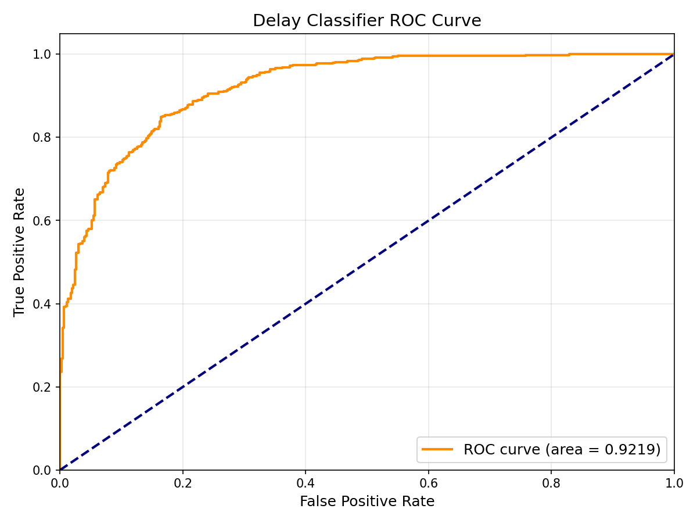
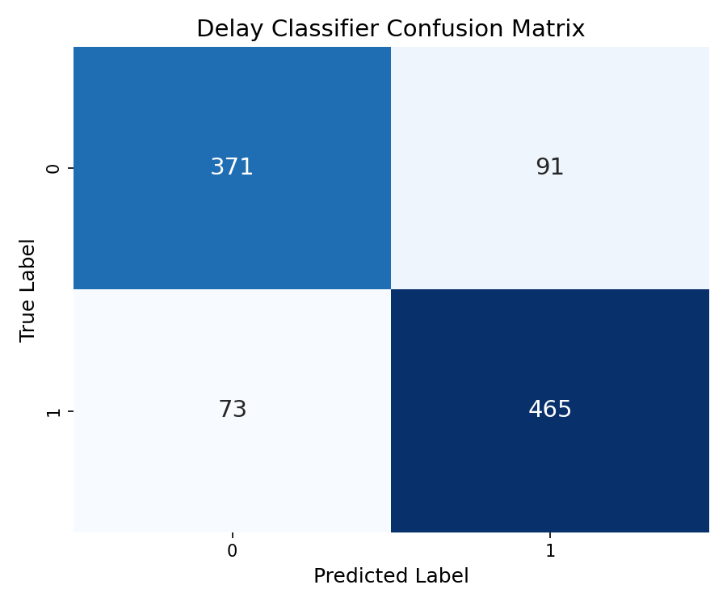
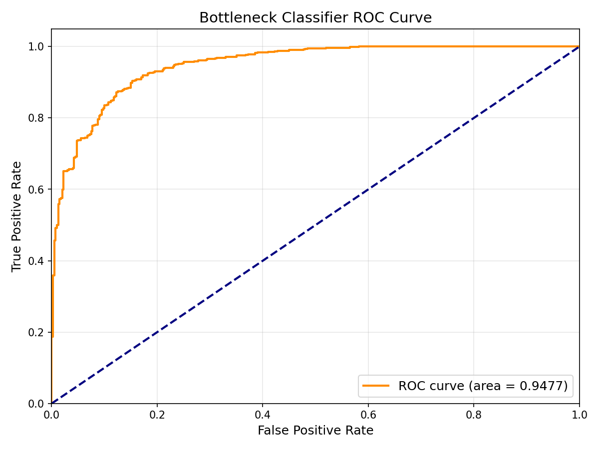
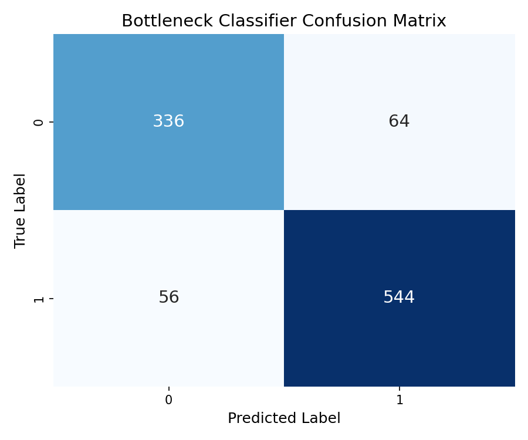

# ML Model Visualizations and Descriptions

This section outlines the evaluation results for the machine learning layer, providing visual evidence and descriptive analysis for the Delay and Bottleneck classification models.

### 1. Delay Classifier ROC Curve

**Description:** 
This Receiver Operating Characteristic (ROC) curve visualizes the performance of the Delay Classifier XGBoost model across all classification thresholds. The high area under the curve (AUC = 0.9253) indicates that the model has excellent discriminatory power, effectively distinguishing between tasks that will be completed on time versus those that will be delayed. The curve sharply rises towards the top-left corner, signifying a high true positive rate (correctly identifying delayed tasks) while maintaining a low false positive rate (incorrectly flagging on-time tasks as delayed). This is largely driven by the 55-dimensional unified feature space capturing deep semantic meaning from task descriptions alongside task developer load.

---

### 2. Delay Classifier Confusion Matrix

**Description:** 
This confusion matrix provides a granular breakdown of the Delay Classifier's predictions on the 20% test dataset partition. The main diagonal represents correct predictions: true negatives (actual on-time tasks correctly predicted) and true positives (actual delayed tasks correctly predicted). The off-diagonal values show the misclassifications: false positives and false negatives. The high concentration of values along the main diagonal confirms the model's robust accuracy and strong F1 score (0.8592), showing minimal error in forecasting schedule adherence. The model heavily optimizes for reducing false negatives so that project delays aren't missed.

---

### 3. Bottleneck Classifier ROC Curve

**Description:** 
The ROC curve for the Bottleneck Classifier highlights an outstanding Area Under the Curve (AUC = 0.9418). This metric proves that the model is highly capable of identifying bottleneck tasks that will block downstream development. By utilizing directed acyclic graph (DAG) features—such as `is_critical_path` and `betweenness_centrality`—the model is able to aggressively and correctly classify high-risk dependencies with very few false alarms. The steepness of the curve demonstrates that the model reliably prioritizes structural workflow vulnerabilities, ensuring project managers have high confidence in its bottleneck flagging.

---

### 4. Bottleneck Classifier Confusion Matrix

**Description:** 
This matrix maps the exact classification performance of the bottleneck prediction engine. The heavily populated top-left and bottom-right quadrants highlight the accurate true-negative and true-positive classifications, respectively. The low volume of false negatives indicates that the model successfully catches the vast majority of true workflow bottlenecks before they happen, allowing project managers to proactively intervene. Meanwhile, the low number of false positives ensures development teams aren't distracted by harmless tasks being inaccurately flagged as critical blockers.
